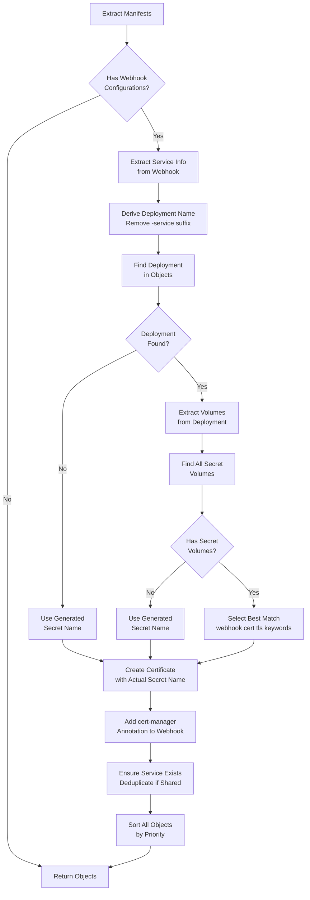

# Webhook Certificate Resolution and Configuration

## Table of Contents
1. [Overview](#overview)
2. [Problem Statement](#problem-statement)
3. [Resolution Flow](#resolution-flow)
4. [Secret Name Discovery](#secret-name-discovery)
5. [Service Management](#service-management)
6. [Resource Ordering](#resource-ordering)
7. [Examples](#examples)
8. [Troubleshooting](#troubleshooting)

## Overview

When extracting OLM bundles that include admission webhooks (ValidatingWebhookConfiguration, MutatingWebhookConfiguration), the tool automatically configures cert-manager to manage TLS certificates. This eliminates the need for OLM's certificate rotation mechanisms and allows operators with webhooks to be installed directly via `kubectl`.

### Why Webhook Certificates Are Needed

Kubernetes admission webhooks require TLS certificates to ensure secure communication between the API server and the webhook service. The certificates must:
- Be trusted by the Kubernetes API server (via CA bundle injection)
- Match the service DNS name (e.g., `my-service.my-namespace.svc`)
- Be mounted in the webhook deployment at the expected path

### How OLM Handles This

OLM uses the OLM Operator Lifecycle Manager to:
- Automatically generate and rotate certificates
- Inject CA bundles into webhook configurations
- Manage certificate secrets with specific naming patterns

### Our Approach

Instead of reimplementing OLM's certificate management, we leverage cert-manager:
- **cert-manager** creates and manages certificates
- **CA injection** is handled by cert-manager's CA injector
- **Secret names** are discovered from deployment volumes (not generated)
- **Service creation** is automated based on deployment configuration

## Problem Statement

### Challenge 1: Secret Name Mismatch

Different operators use different naming conventions for webhook certificate secrets:
- `operator-webhook-cert`
- `operator-controller-webhook-tls`
- `serving-cert`
- `webhook-server-cert`

**Solution**: Instead of guessing or generating names, we inspect the deployment's volume mounts to find the actual secret name the deployment expects.

### Challenge 2: Service Configuration

Webhook configurations reference services, but these services may not exist in the bundle or may be incomplete.

**Solution**: We automatically create or update services based on:
- Webhook service references in ValidatingWebhookConfiguration/MutatingWebhookConfiguration
- Deployment information (selectors, ports)
- Deduplication when multiple webhooks share the same service

### Challenge 3: Resource Dependencies

Resources must be applied in the correct order:
- Namespace must exist first
- Services must exist before Certificates reference them
- Certificates must exist before Webhooks reference their secrets

**Solution**: All resources are sorted by priority before output, ensuring correct `kubectl apply` order.

## Resolution Flow

The following diagram illustrates how webhook certificates are resolved and configured:



### Step-by-Step Process

1. **Extract Service Info**: Parse webhook configuration to get service name, namespace, and port
2. **Derive Deployment Name**: Remove `-service` suffix from service name
3. **Find Deployment**: Search extracted objects for matching deployment
4. **Extract Volumes**: Get all volumes from deployment's pod template spec
5. **Find Secret Volumes**: Filter volumes to only secret types
6. **Select Best Secret**: Use keyword matching to identify webhook certificate secret
7. **Create Certificate**: Generate cert-manager Certificate resource with discovered secret name
8. **Add Annotation**: Add `cert-manager.io/inject-ca-from` annotation to webhook
9. **Ensure Service**: Create or verify service exists with correct configuration
10. **Sort Resources**: Order all resources by priority for proper kubectl apply

## Secret Name Discovery

### Primary Strategy: Volume Inspection

The most reliable way to determine the webhook certificate secret name is to inspect the deployment's volumes:

```go
// Example deployment volume configuration
volumes:
  - name: cert
    secret:
      secretName: operator-webhook-cert  // This is what we extract
```

### Keyword Matching

When multiple secret volumes exist, we use keyword-based heuristics to select the most likely webhook certificate:

**Keywords** (case-insensitive):
- `webhook`
- `cert`
- `tls`
- `serving`

**Matching Logic**:
1. Check both secret name and volume name for keywords
2. Return first match found
3. If no match, return first secret (most deployments have only one)

### Fallback Strategy

If the deployment cannot be found or has no secret volumes:

**Generated Name Pattern**: `<service-name>-tls`

Example: 
- Service: `operator-controller-manager-service`
- Generated Secret: `operator-controller-manager-service-tls`

### Why This Approach Is Generic

This strategy works across all OLM bundles because:
- It doesn't rely on naming conventions
- It inspects the actual deployment configuration
- It adapts to different operator implementations
- Fallback ensures compatibility even with unusual configurations

## Service Management

### Service Discovery

Webhooks reference services in their `clientConfig.service` field:

```yaml
webhooks:
  - clientConfig:
      service:
        name: operator-webhook-service
        namespace: operator-system
        port: 443
```

### Service Creation

If the service doesn't exist in the extracted manifests, we create it based on:

1. **Service Name**: From webhook configuration
2. **Namespace**: Target namespace for installation
3. **Port**: From webhook configuration (default: 443)
4. **Selector**: From deployment's pod template labels
5. **Target Port**: From deployment's container ports

### Service Deduplication

Multiple webhooks may share the same service:

```
ValidatingWebhook-1 ─┐
                      ├─> same-service
ValidatingWebhook-2 ─┘
```

The `processedServiceNames` map tracks which services have been processed:

```go
processedServices := make(map[string]bool)

// First webhook processes the service
if !processedServices[serviceName] {
    services, err := kube.EnsureService(...)
    result = append(result, services...)
    processedServices[serviceName] = true
}
// Second webhook skips service (already processed)
```

This prevents duplicate service definitions in the output.

### Port Verification

If a service already exists but has incorrect ports, we update it:

```go
// Check existing port
if service.Spec.Ports[0].Port != expectedPort {
    service.Spec.Ports[0].Port = expectedPort
}
```

## Resource Ordering

Resources must be applied in a specific order to satisfy dependencies:

### Priority Levels

```
1. Namespace               (must exist for all namespaced resources)
2. CRD                     (define custom resource types)
3. ServiceAccount          (required by deployments)
4. Role                    (define permissions)
5. RoleBinding             (grant permissions)
6. ClusterRole             (define cluster permissions)
7. ClusterRoleBinding      (grant cluster permissions)
8. Deployment              (creates pods)
9. Service                 (endpoints for deployments)
10. Certificate            (creates secrets for services)
11. Webhook                (references certificates/services)
12. Other                  (remaining resources)
```

### Why Ordering Matters

**Namespace First**: All namespaced resources require the namespace to exist.

**Service Before Certificate**: Certificates reference services in their DNS names:
```yaml
spec:
  dnsNames:
    - my-service.my-namespace.svc
```

**Certificate Before Webhook**: Webhooks expect the certificate secret to exist:
```yaml
spec:
  template:
    spec:
      volumes:
        - name: cert
          secret:
            secretName: webhook-cert  # Must exist
```

### Implementation

Sorting is applied twice:
1. **After extraction**: In `extract.Manifests()` for typed objects
2. **After cert-manager configuration**: In `cmd/main.go` for unstructured objects

This ensures correct ordering even when cert-manager adds new resources.

## Examples

### Example 1: Simple Webhook Configuration

**Input Bundle**:
- ValidatingWebhookConfiguration (references `operator-service`)
- Deployment `operator` (has secret volume `operator-webhook-cert`)

**Output**:
```yaml
---
apiVersion: v1
kind: Service
metadata:
  name: operator-service
  namespace: operator-system
spec:
  selector:
    app: operator
  ports:
    - port: 443
      targetPort: 9443
---
apiVersion: cert-manager.io/v1
kind: Certificate
metadata:
  name: operator-service-cert
  namespace: operator-system
spec:
  secretName: operator-webhook-cert  # Extracted from deployment
  dnsNames:
    - operator-service.operator-system.svc
  issuerRef:
    kind: ClusterIssuer
    name: selfsigned-cluster-issuer
---
apiVersion: admissionregistration.k8s.io/v1
kind: ValidatingWebhookConfiguration
metadata:
  name: operator-webhook
  annotations:
    cert-manager.io/inject-ca-from: operator-system/operator-service-cert
```

### Example 2: Shared Service

**Input Bundle**:
- ValidatingWebhookConfiguration (references `operator-service`)
- MutatingWebhookConfiguration (references `operator-service`)
- Deployment `operator`

**Output**:
```yaml
# Service created once (deduplicated)
---
apiVersion: v1
kind: Service
metadata:
  name: operator-service
  namespace: operator-system
---
# Certificate created once
apiVersion: cert-manager.io/v1
kind: Certificate
metadata:
  name: operator-service-cert
  namespace: operator-system
spec:
  secretName: operator-webhook-cert
---
# Both webhooks reference the same certificate
apiVersion: admissionregistration.k8s.io/v1
kind: ValidatingWebhookConfiguration
metadata:
  annotations:
    cert-manager.io/inject-ca-from: operator-system/operator-service-cert
---
apiVersion: admissionregistration.k8s.io/v1
kind: MutatingWebhookConfiguration
metadata:
  annotations:
    cert-manager.io/inject-ca-from: operator-system/operator-service-cert
```

## Troubleshooting

### Issue: "secret not found" in deployment

**Symptom**: Deployment fails with error about missing secret

**Cause**: Secret name mismatch between Certificate and Deployment

**Solution**:
1. Check what secret the deployment expects:
   ```bash
   kubectl get deployment <name> -o yaml | grep -A5 volumes:
   ```
2. Check what secret the Certificate creates:
   ```bash
   kubectl get certificate <name> -o yaml | grep secretName
   ```
3. If they don't match, the secret name extraction failed. Check if the deployment was in the original bundle.

### Issue: Webhook not ready

**Symptom**: `kubectl get validatingwebhookconfiguration` shows webhook not ready

**Cause**: Certificate not issued or CA bundle not injected

**Solution**:
1. Check Certificate status:
   ```bash
   kubectl get certificate -n <namespace>
   kubectl describe certificate <name> -n <namespace>
   ```
2. Check if cert-manager is running:
   ```bash
   kubectl get pods -n cert-manager
   ```
3. Check if CA injector annotation is present:
   ```bash
   kubectl get validatingwebhookconfiguration <name> -o yaml | grep inject-ca-from
   ```

### Issue: Service endpoint not found

**Symptom**: Webhook fails with "connection refused" or "no endpoints"

**Cause**: Service selector doesn't match deployment pods

**Solution**:
1. Check service selector:
   ```bash
   kubectl get service <name> -o yaml | grep -A5 selector:
   ```
2. Check deployment labels:
   ```bash
   kubectl get deployment <name> -o yaml | grep -A5 matchLabels:
   ```
3. Ensure labels match. If they don't, the service was created with incorrect selectors.

### Issue: cert-manager not installed

**Symptom**: Certificates remain in "Pending" state

**Cause**: cert-manager is not installed in the cluster

**Solution**:
Install cert-manager:
```bash
kubectl apply -f https://github.com/cert-manager/cert-manager/releases/download/v1.14.0/cert-manager.yaml
```

Create ClusterIssuer:
```bash
kubectl apply -f - <<EOF
apiVersion: cert-manager.io/v1
kind: ClusterIssuer
metadata:
  name: selfsigned-cluster-issuer
spec:
  selfSigned: {}
EOF
```

### Issue: Wrong ClusterIssuer name

**Symptom**: Certificate shows "Issuer not found"

**Cause**: Certificate references non-existent ClusterIssuer

**Solution**:
Use `--cert-manager-issuer-name` flag to specify correct issuer:
```bash
bundle-extract <bundle> -n <namespace> \
  --cert-manager-issuer-name=my-issuer \
  --cert-manager-issuer-kind=ClusterIssuer
```

### Disabling cert-manager Integration

If you want to manage certificates manually:

```bash
bundle-extract <bundle> -n <namespace> --cert-manager-enabled=false
```

Note: You will need to manually:
- Create certificate secrets
- Inject CA bundles into webhook configurations
- Ensure service endpoints are configured correctly

